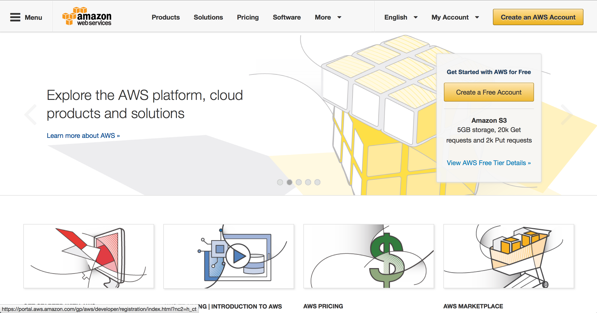
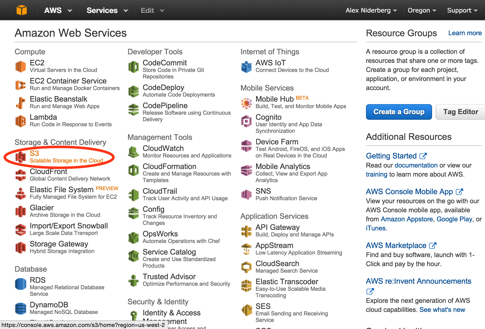
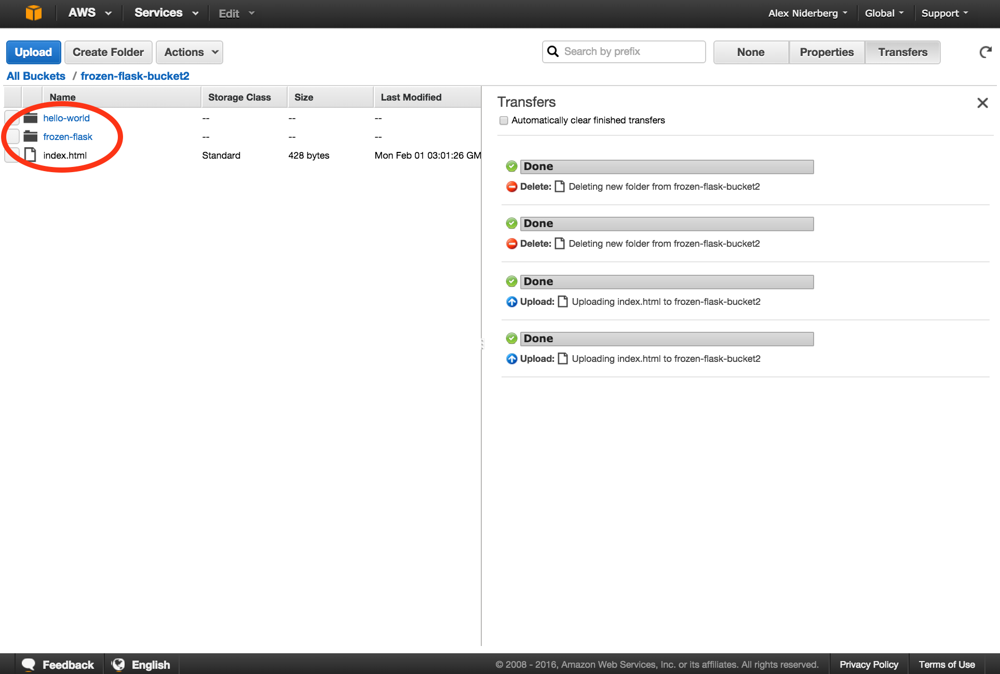
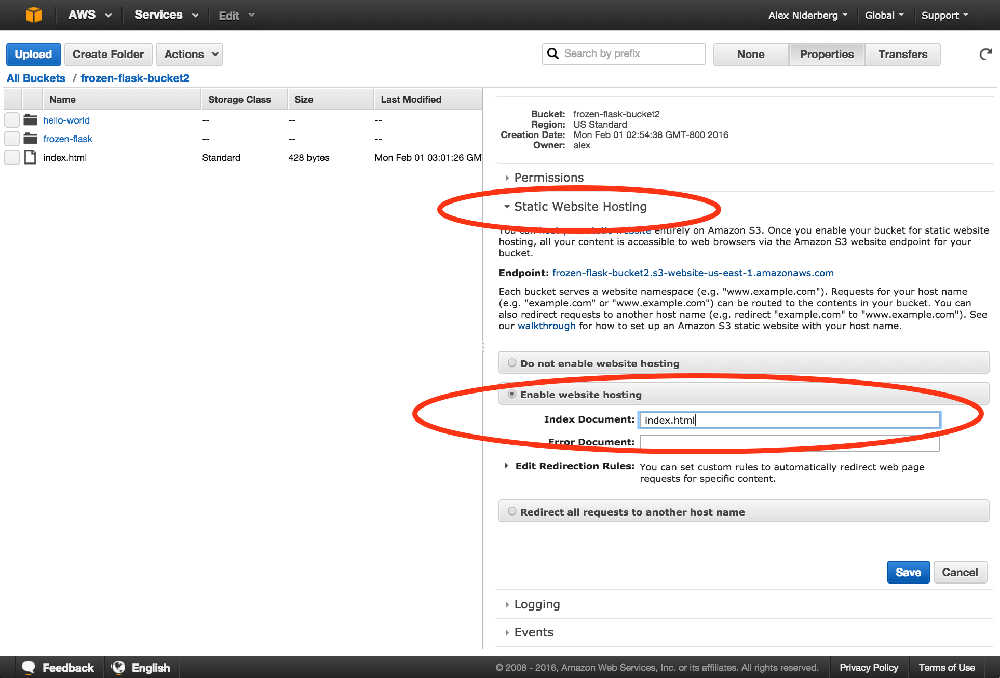
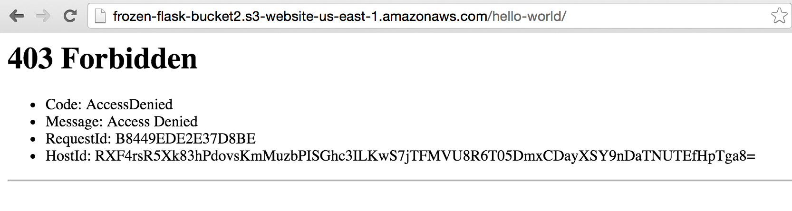
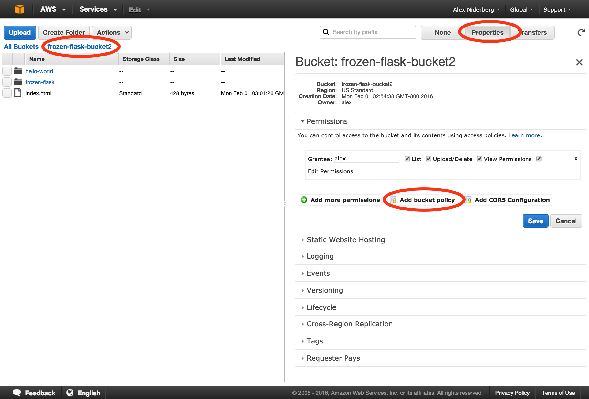
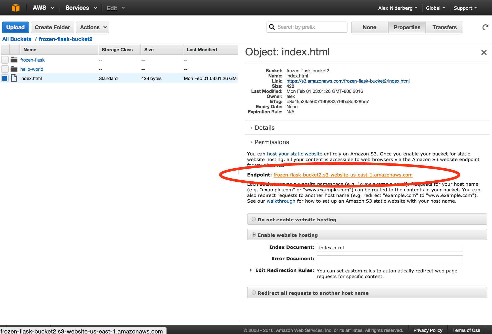

##Static site generation

###_(W/ Frozen-Flask and AWS S3)_
<p>
	</br>
	  <small>Alex Niderberg</a> | <a href="https://twitter.com/alexniderberg">@AlexNiderberg</a></small><br/>
	<small>Technical Product Owner / Master Software Engineer <br/><br/>@ Capital One Labs</small>
</p>


---

#Frozen Flask


- [Official Site](http://pythonhosted.org/Frozen-Flask/)
- [Tutorial I followed](https://nicolas.perriault.net/code/2012/dead-easy-yet-powerful-static-website-generator-with-flask/)
  - <small>**I need to submit a PR with a few fixes</small>
<!-- - [Place to submit PR with updates](https://github.com/n1k0/nicolas.perriault.net/) -->


<iframe src="http://giphy.com/embed/vBVCam8nE7uxy?hideSocial=true" width="680" height="567" frameborder="0" class="giphy-embed" allowfullscreen=""></iframe>
<!-- Polar Bear GIFS
ollAndSlide-XGHCQGcfyl6lW
Help-H2VD6psStWlJ6
GetTheBabby-vBVCam8nE7uxy
CuddleFest-2ur8NS5TYQmK4
Pouncing-2c2DyqhbixfUY
ConfusionCubsRunning-FdvUazOcLjwzK -->
<!-- Penguin GIFS 
Slap-wHSMEx2TtEo8
Flying?-tbAY4hlx9fzjy
Let-sGetOutOfHere-9hbECTMVSdG0
getOutOfTheHouse-B1JDGg2BgvfVe
JumpingPenguins-otnqsqqzmsw7K
penguinSlide_hereWeGo-9UCStxAde7lK -->


<iframe id="ytplayer" type="text/html" width="640" height="390"
  src="http://www.youtube.com/embed/L0MK7qz13bU?autoplay=0&start=65"
  frameborder="0"/>


###Getting started
```shell
mkdir sample_project && cd $_
virtualenv venv
source venv/bin/activate
pip install Flask Frozen-Flask Flask-FlatPages
touch sitebuilder.py
# add content
python sitebuilder.py
# visit localhost:8000
mkdir pages
touch pages/hello-world.md
# add page content
mkdir templates
touch templates/base.html
# add content
touch templates/page.html
# add content
touch templates/index.html
# add content
```


###Hands-on
```
git clone https://github.com/aln787/frozenFlask.git && cd $_
virtualenv venv
source venv/bin/activate
pip install
```

---

#Why AWS / Register




- [Register](https://portal.aws.amazon.com/gp/aws/developer/registration/index.html)

---

#AWS S3 Deploy








####Files and Folders to add to S3
```
pwd
# <your path>/frozenFlask
cd build/
ls -lah
#drwxr-xr-x   3 <user>  <group>   102B Jan 27 01:23 frozen-flask
#drwxr-xr-x   3 <user>  <group>   102B Jan 27 01:23 hello-world
#-rw-r--r--   1 <user>  <group>   428B Jan 27 01:23 index.html
```











###Bucket policy to add
```
{
	"Version": "2008-10-17",
	"Statement": [
		{
			"Sid": "AllowPublicRead",
			"Effect": "Allow",
			"Principal": {
				"AWS": "*"
			},
			"Action": "s3:GetObject",
			"Resource": "arn:aws:s3:::frozen-flask-bucket2/*"
		}
	]
}
```




- [Example Simple Frozen-Flask Site](http://frozen-flask-bucket2.s3-website-us-east-1.amazonaws.com/)
- [S3 Bucket(*Permission required to view)](https://console.aws.amazon.com/s3/home?region=us-west-2#&bucket=frozen-flask-bucket2&prefix=)

---

#ASW CLI S3 Deploy


###AWS CLI Install
```shell
python --version
#Looking for above 2.6.5+ or 3.3+
curl "https://s3.amazonaws.com/aws-cli/awscli-bundle.zip" -o "awscli-bundle.zip"
unzip awscli-bundle.zip
./awscli-bundle/install -b ~/bin/aws
echo $PATH | grep ~/bin #See if $PATH contains ~/bin (output will be empty if it doesn't)
export PATH=~/bin:$PATH #Add ~/bin to $PATH if necessary
#Confirm the install worked correctly
aws help
```
- [Additional details / official AWS CLI install instructions](http://docs.aws.amazon.com/cli/latest/userguide/installing.html#install-bundle-other-os)


####Configure the AWS CLI
```shell
aws configure
#AWS Access Key ID [None]: <Your Key>
#AWS Secret Access Key [None]: <Your Secret>
#Default region name [None]: us-east-1
#Default output format [None]: json
```

<br>
####S3 bucket creation, content sync and configuration
```shell
#aws s3 rb s3://frozen-flask-cli --force  #Remove existing folder with this name
aws s3 mb s3://frozen-flask-cli
pwd
#<your path>/frozenFlask
aws s3 sync build/ s3://frozen-flask-cli --exclude '.DS_Store'
aws s3api put-bucket-policy --bucket frozen-flask-cli --policy file://bucketPolicy.json
aws s3api put-bucket-website --bucket frozen-flask-cli --website-configuration file://enableWebHosting.json
#aws s3api put-bucket-website help
```

- *Note: the AWS API requests for "put-bucket-website" fails with an unclear error messages, if your bucket name contains any capital letters.

---

#AWS Automation 
##W/ Python Boto3

---

#Additional Information


###Alternative tools
- Explored
	- Pelican, Jekyll
- Still to Explore
  - [Lektor](https://www.getlektor.com/), [Hugo](https://gohugo.io/), Hexo, Hyde, Brunch, Middleman, Harp, Expose, ...


###Links
- [Blog that inspired investigating frozen flask](http://lucumr.pocoo.org/2015/12/21/introducing-lektor/
)
- [Place to submit PR with updates](https://github.com/n1k0/nicolas.perriault.net/)
