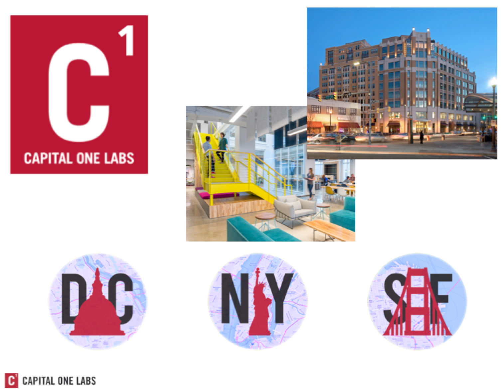
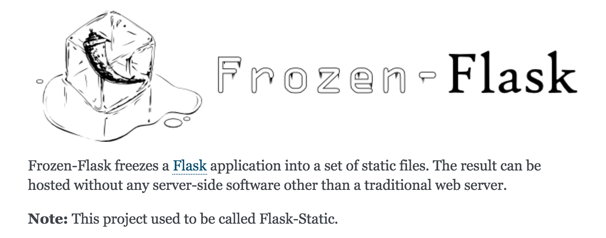

##Static site generation

###_(W/ Frozen-Flask and AWS S3)_
<p>
	</br>
	  <small>Alex Niderberg</a> | <a href="https://twitter.com/alexniderberg">@AlexNiderberg</a></small><br/>
	<small>Technical Product Owner / Master Software Engineer <br/><br/>@ Capital One Labs</small>
</p>





---

#Frozen Flask




- [Official Site](http://pythonhosted.org/Frozen-Flask/)
- [Tutorial I followed](https://nicolas.perriault.net/code/2012/dead-easy-yet-powerful-static-website-generator-with-flask/)
  - <small>**I need to submit a PR with a few fixes</small>
<!-- - [Place to submit PR with updates](https://github.com/n1k0/nicolas.perriault.net/) -->


###Getting started
```shell
mkdir sample_project && cd $_
virtualenv venv
source venv/bin/activate
pip install Flask Frozen-Flask Flask-FlatPages
touch sitebuilder.py
# add content
python sitebuilder.py
# visit localhost:8000
mkdir pages
touch pages/hello-world.md
# add page content
mkdir templates
touch templates/base.html
# add content
touch templates/page.html
# add content
touch templates/index.html
# add content
```


###Hands-on
```
git clone https://github.com/aln787/frozenFlask.git && cd $_
virtualenv venv
source venv/bin/activate
pip install
```

---

#AWS S3 Deploy


###Add screen shots

---

#ASW CLI / S3 Deploy

---

#AWS Automation 
##W/ Python Boto3

---

#Additional Information


###Alternative tools
- Explored
	- Pelican, Jekyll
- Still to Explore
  - [Lektor](https://www.getlektor.com/), [Hugo](https://gohugo.io/), Hexo, Hyde, Brunch, Middleman, Harp, Expose, ...


###Links
- [Blog that inspired investigating frozen flask](http://lucumr.pocoo.org/2015/12/21/introducing-lektor/
)
- [Place to submit PR with updates](https://github.com/n1k0/nicolas.perriault.net/)
